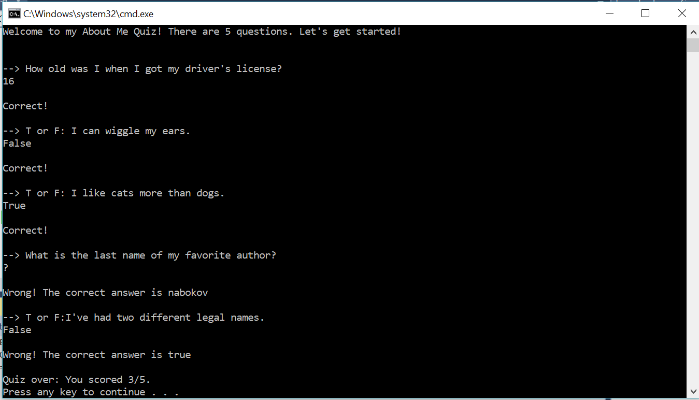

# Lab01-AboutMeQuiz
## Purpose
This lab is a simple 'About Me' quiz that asks 5 questions, gives feedback on correct/incorrect answers, and
provides a final, total score at the end.
## Instructions
Clone the repo and open the project in Visual Studio. ctrl+F5 will run the program without debugging. Hit enter
to exit the console at the end of the game.
## Example program execution

